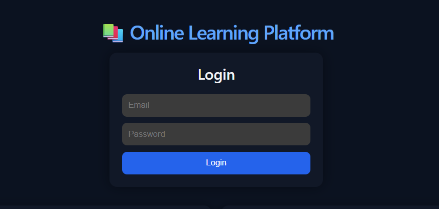
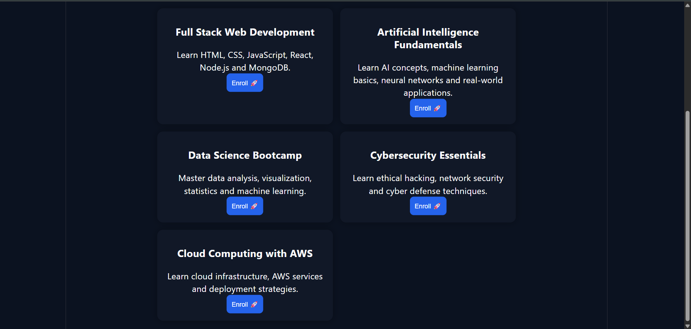
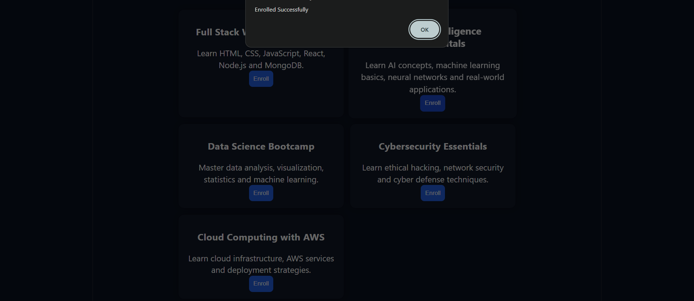

# 🚀 Online Learning & Course Recommendation Platform (LMS)

A full-stack MERN-based Learning Management System where users can register, login, view courses, and enroll using JWT authentication.

---

## 🔥 Live Demo
https://full-stack-development-online-learning.onrender.com

---

## ✨ Features

- 🔐 User Registration & Login (JWT Authentication)
- 📚 View Available Courses
- 🚀 Course Enrollment System
- 🧠 Basic Course Recommendation Logic
- 🗄️ MongoDB Atlas Database Integration
- 🔒 Protected Routes using Middleware
- 🌐 Backend Deployment on Render
- ⚡ REST API Integration

---

## 🛠️ Tech Stack

Frontend: React.js, JavaScript, CSS  
Backend: Node.js, Express.js  
Database: MongoDB Atlas  
Auth: JWT (JSON Web Token)

---

## 📸 Screenshots

### 🏠 Home Page

### 📚 Courses Page

### 🚀 Enrollment Success

---

## 📁 How to Add Screenshots

Create this folder in your project:

client/src/assets/screenshots/

Then add images like:

home.png  
login.png  
courses.png  
enroll.png  

---

## 📁 Project Structure

client/
  src/
    assets/
      screenshots/

server/
  controllers/
  models/
  routes/
  middleware/
  server.js

---

## ⚙️ Setup Instructions

### 1. Clone Repo
git clone https://github.com/Aarthikole18/Full-stack-Development-Online-Learning-and-Course-Recommendation-Platform.git

---

### 2. Backend Setup
cd server  
npm install  
npm run dev  

---

### 3. Frontend Setup
cd client  
npm install  
npm run dev  

---

## 🔐 Environment Variables

Create `.env` inside `/server`:

PORT=5000  
MONGO_URI=your_mongodb_connection_string  
JWT_SECRET=your_secret_key  

---

## 🚀 API Endpoints

Auth:
POST /api/auth/register  
POST /api/auth/login  

Courses:
GET /api/courses  

Enrollments:
POST /api/enrollments  

---

## 👩‍💻 Author

Aarthi Kole  

---

## ⭐ Support

If you like this project, please give it a ⭐ on GitHub
